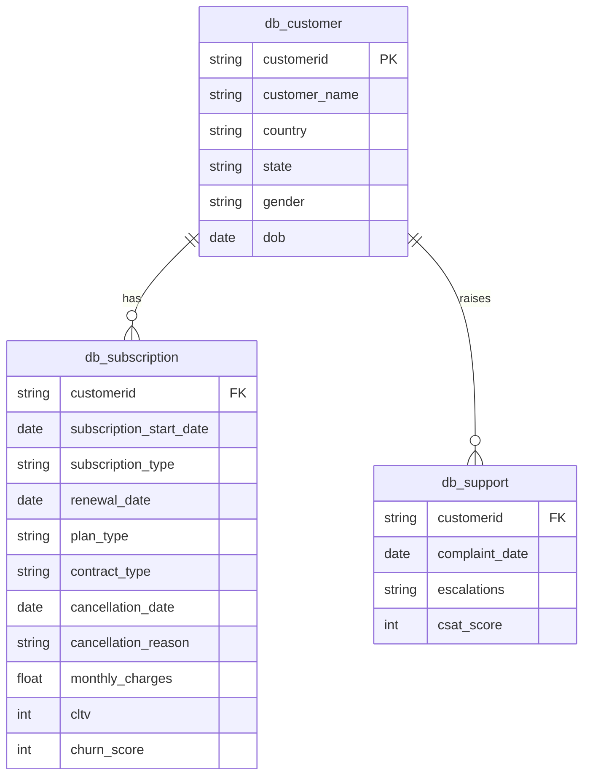
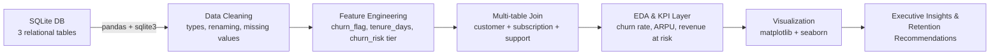
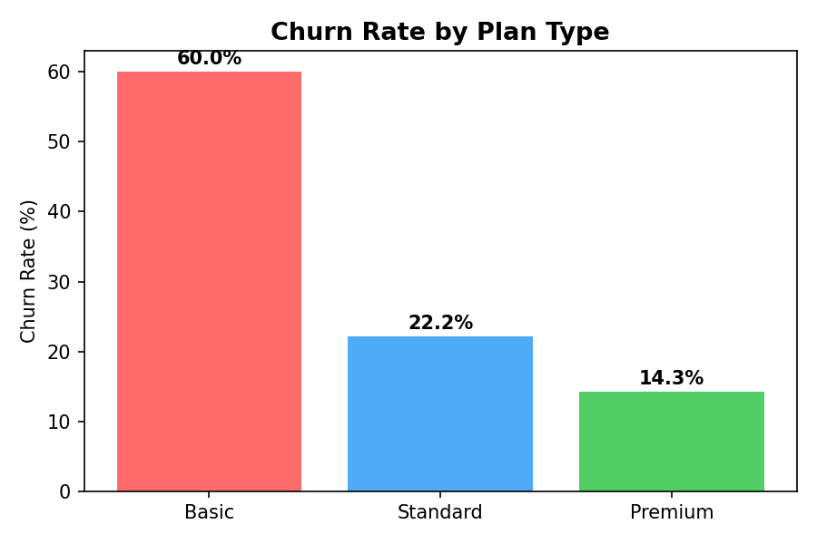
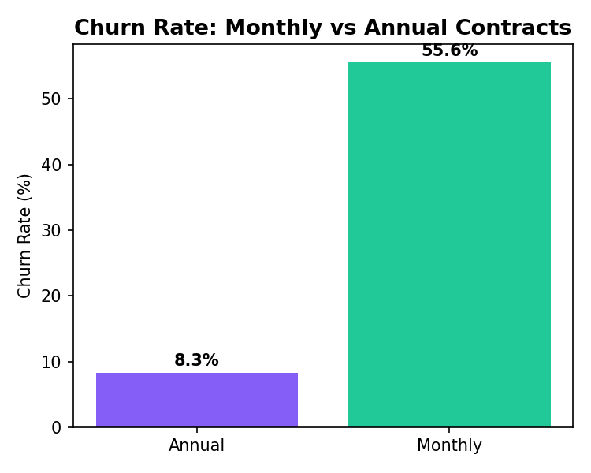
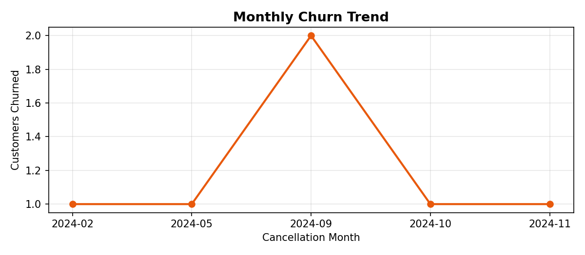
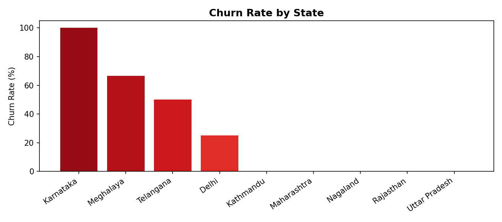
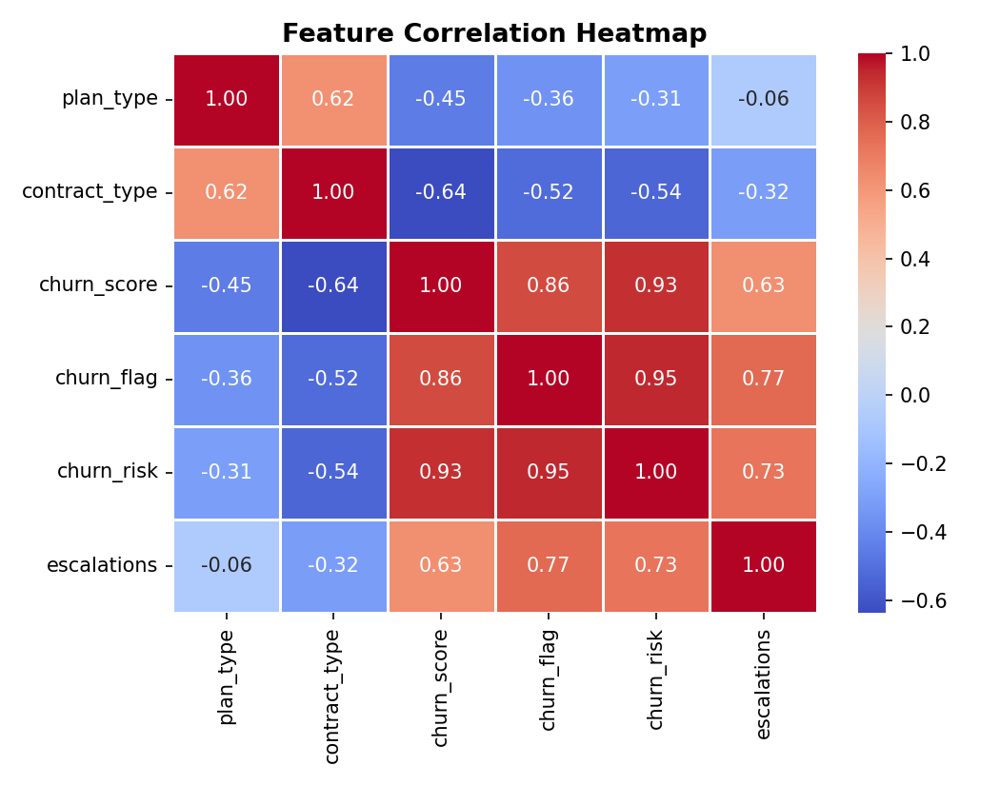
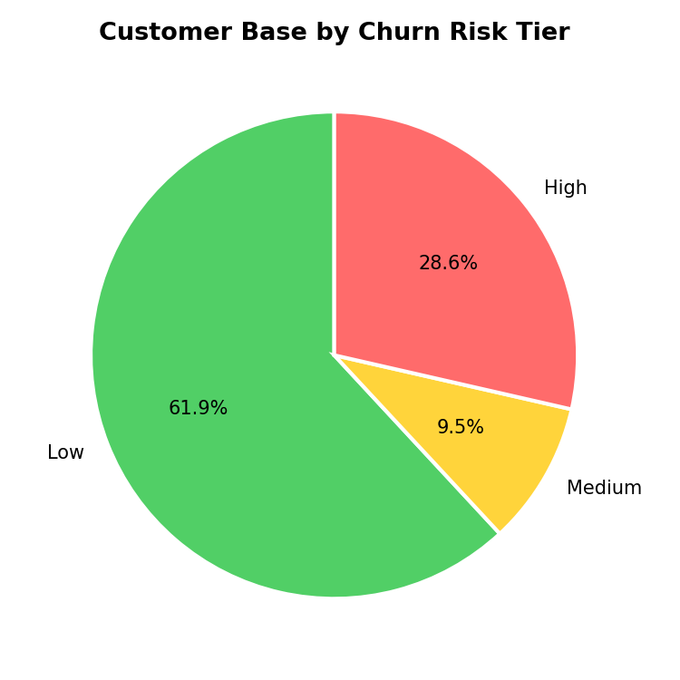

# 📉 Churn Analysis & Customer Intelligence

**End-to-end churn analytics pipeline for an OTT subscription platform — SQL + Python, from raw relational data to executive-ready retention strategy.**


---

## 📌 Overview

In the hyper-competitive OTT landscape (Netflix, Hotstar, Prime-style platforms), **retention is the primary growth lever** — acquiring a new subscriber costs far more than keeping one. This project simulates a Data Analyst engagement where the goal is to identify high-risk subscribers and quantify the revenue impact of churn, using a **multi-table relational dataset** covering customer demographics, subscription/billing details, and support-escalation history.

The analysis answers three core questions:

| | |
|---|---|
| 🧍 **Who** | Which customers have churned, and which active customers are most likely to churn next? |
| 🔍 **Why** | What behavioral and support signals precede a cancellation? |
| ⏱️ **When** | Is there a "danger zone" in the customer lifecycle where churn risk spikes? |

---

## 🗄️ Data Model (ERD)

Three relational tables joined on `customerid`:



---

## 🔄 Pipeline / Workflow



---

## 🧰 Tech Stack

- **Data extraction:** `sqlite3`, `pandas.read_sql`
- **Cleaning & feature engineering:** `pandas`, `numpy`
- **EDA:** groupby aggregation, pivot tables
- **Visualization:** `matplotlib`, `seaborn` (trend lines, bar charts, correlation heatmap, risk segmentation)
- **Analysis surface:** Jupyter Notebook + standalone SQL query library

---

## 📊 Key Results

| KPI | Value |
|---|---|
| **Overall churn rate** | 28.6% |
| **Retention rate** | 71.4% |
| **Monthly-contract churn** | 55.6% |
| **Annual-contract churn** | 8.3% (**6.7x lower**) |
| **ARPU** | ₹18.85 |
| **Avg. customer tenure** | ~1,512 days |
| **Revenue at risk (MRR)** | ₹73.94 (**18.7%** of total MRR) |
| **CLTV lost to churn** | ₹2,047 |
| **Escalation ↔ churn correlation** | 0.77 (strong positive) |

### Churn by Plan Type


### Monthly vs. Annual Contract Churn


### Monthly Churn Trend


### Churn by State


### Feature Correlation Heatmap


### Customer Base by Churn-Risk Tier


---

## 💡 Insights

- **Contract type is the strongest churn driver** — monthly subscribers churn at 6.7x the rate of annual subscribers, making contract migration the single highest-leverage retention play.
- **Basic plan has the highest churn (60%)** but the lowest revenue-per-user, so it's a volume problem, not a revenue crisis; **Premium is the stickiest tier (14.3% churn)**.
- **Support escalations are strongly correlated with churn (r = 0.77)** — an open escalation is one of the earliest reliable warning signs of an at-risk customer.
- One state in the sample shows a 100% churn rate, flagging a region-specific issue (pricing, service quality, or a competitor move) worth investigating rather than dismissing as noise.

## 🚀 Recommended Actions

1. **Contract-migration campaign** — targeted discount/loyalty incentive to move monthly subscribers onto annual plans.
2. **Escalation-triggered retention workflow** — auto-flag any customer with an open support escalation for proactive outreach before they hit the cancellation page.
3. **Priority save-list** — rank active customers by `churn_score × cltv` and route the top segment to retention agents first (see `sql/churn_kpi_queries.sql`, query 12).
4. **Regional audit** — investigate the high-churn state(s) for pricing or service-quality issues before assuming random variance.

---

## 📁 Repository Structure

```
churn-analysis-customer-intelligence/
├── README.md
├── LICENSE
├── requirements.txt
├── data/
│   ├── customer_churn.db              # source SQLite database (3 tables)
│   └── customer_churn_data_raw.xlsx   # raw Excel fallback for DB import
├── notebooks/
│   └── churn_analysis.ipynb           # full analysis, cleaning → insights
├── sql/
│   └── churn_kpi_queries.sql          # all KPIs reproduced as standalone SQL
├── images/                            # exported chart PNGs (used above)
└── outputs/
    └── exported_churn_data.csv        # cleaned, merged, feature-engineered dataset
```

---

## ▶️ How to Run

```bash
git clone https://github.com/Aman1-23/churn-analysis-customer-intelligence.git
cd churn-analysis-customer-intelligence
pip install -r requirements.txt
jupyter notebook notebooks/churn_analysis.ipynb
```

To run the KPI queries directly against the database:

```bash
sqlite3 data/customer_churn.db < sql/churn_kpi_queries.sql
```

---

## 👤 Author

**Aman Kumar**
B.Tech, Computer Science & Data Science — Maharana Pratap Engineering College, Kanpur
Aspiring Data Analyst | SQL · Python · Power BI · A/B Testing

- 📧 amank273054@gmail.com
- 💼 [LinkedIn](https://linkedin.com/in/aman-kumar-96a28a372)
- 💻 [GitHub](https://github.com/Aman1-23)
- 🧩 [LeetCode](https://leetcode.com/u/Aman8886/)

---

*This project was built as a hands-on churn analytics exercise to practice relational data extraction, feature engineering, and translating technical findings into business-ready retention recommendations.*
